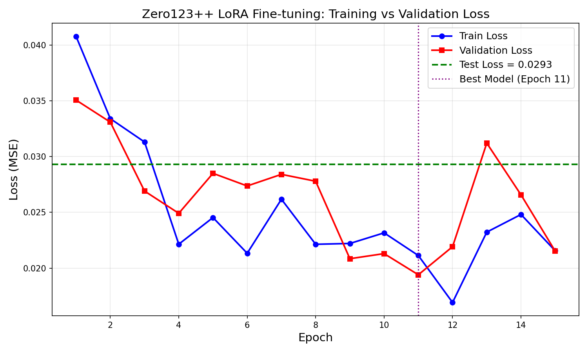
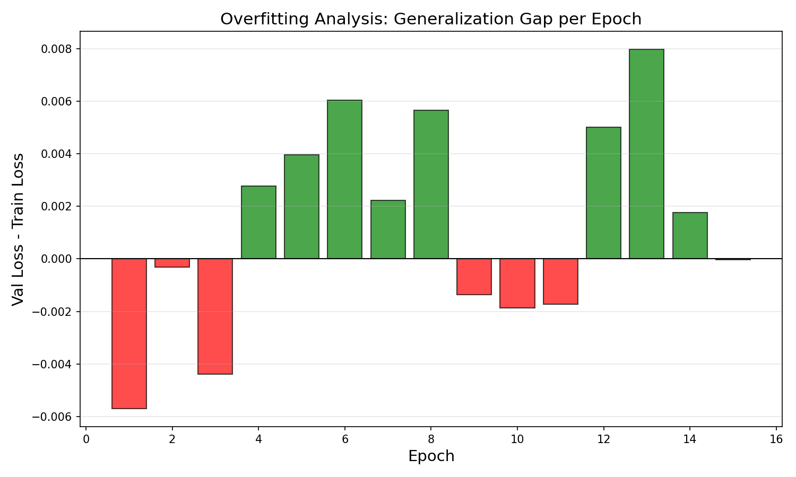

 🪑 Image-to-3D: Zero123++ LoRA Fine-tuning for Chair Generation

[](https://huggingface.co/spaces/kokonut213/zero123-chair-demo)

**Samsung Innovation Campus AI Course - Capstone Project**

Fine-tuning Zero123++ v1.2 with LoRA for multi-view chair generation + 3D mesh with TripoSR.

## Pipeline
```
Input Image -> Zero123++ v1.2 + LoRA -> 6 Views -> TripoSR -> 3D Mesh (.glb)
```

## Training Results

| Metric | Value |
|--------|-------|
| Model | Zero123++ v1.2 |
| Fine-tuning | LoRA (rank=8, alpha=1.0) |
| Dataset | 600 Objaverse chairs |
| Train/Val/Test | 480 / 60 / 60 |
| Epochs | 15 |
| Batch Size | 2 |
| Learning Rate | 5e-5 |
| Trainable Params | ~1.3M / 860M (0.15%) |
| **Best Val Loss** | **0.0194** (epoch 11) |
| **Test Loss** | **0.0293** |
| GPU | NVIDIA A10 (24GB) |
| Training Time | ~2.5 hours |

### Loss Curves


### Overfit Analysis


## Usage

### Training
```bash
python train.py --data_dir ./training_data --epochs 15 --batch_size 2
```

### Evaluation
```bash
python evaluate.py --checkpoint ./checkpoints/zero123_lora_best.pt --data_dir ./training_data
```

### Live Demo
https://huggingface.co/spaces/kokonut213/zero123-chair-demo

## Project Structure
```
image-to-3d-zero123/
├── train.py                     # LoRA fine-tuning
├── evaluate.py                  # Testing & evaluation
├── app.py                       # HuggingFace Space deployment
├── prepare_3d_data.py           # Dataset preparation
├── render_script.py             # Blender rendering
├── configs/training_config.json # Hyperparameters
├── results/                     # Charts & metrics
└── notebooks/training_notebook.ipynb
```

## Acknowledgments
- [Zero123++](https://github.com/SUDO-AI-3D/zero123plus) by SUDO AI
- [TripoSR](https://github.com/VAST-AI-Research/TripoSR) by Stability AI
- [Objaverse](https://objaverse.allenai.org/) by Allen AI
- Samsung Innovation Campus
